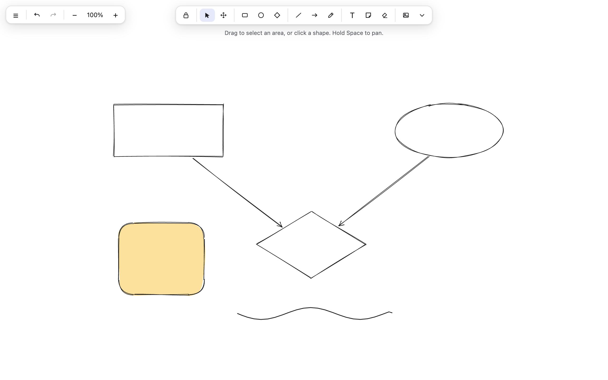
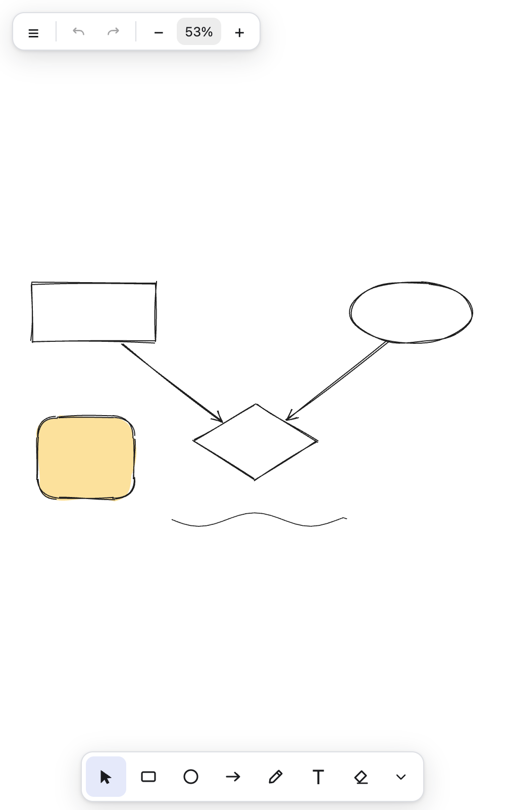

# Deviva Draw

[](https://www.npmjs.com/package/@deviva-draw/engine)
[](https://www.npmjs.com/package/@deviva-draw/react)
[](https://www.npmjs.com/package/@deviva-draw/collab-client)
[](https://www.npmjs.com/package/@deviva-draw/mcp)
[](LICENSE)

An open-source, infinite-canvas whiteboard — a framework-agnostic drawing
engine, a React component library, and a collaborative web app. Built entirely
from scratch (clean-room: no Excalidraw or tldraw code) and released under the
MIT license.

> Deviva Draw is a child project of **[Deviva](https://deviva.app/)**. It powers
> the drawing and diagramming canvas inside Deviva, and is published on its own
> so anyone can use it, embed it, or contribute to it independently.

**Try it live at [draw.deviva.app](https://draw.deviva.app).**

## Screenshots

<p align="center">
  
</p>

<p align="center">
  
  <br>
  <em>Responsive: a compact bottom toolbar on phones, with the overflow tools one tap away.</em>
</p>

## Features

- **Rich drawing tools** — rectangle, ellipse, diamond, triangle, hexagon, star,
  cloud, heart, x-box, check-box, line, arrow (with shape-to-shape binding),
  freehand ink, highlighter, block arrows, text, sticky notes, frames, and image
  insert.
- **Sketchy, hand-drawn look** — powered by [rough.js](https://roughjs.com/) and
  [perfect-freehand](https://github.com/steveruizok/perfect-freehand), with solid
  styling when you want clean lines.
- **Full editing model** — select, marquee & lasso select, move, resize, rotate,
  align/distribute, group/ungroup, z-ordering, snapping, grid, undo/redo.
- **Live collaboration** — real-time multiplayer with presence cursors over
  Cloudflare Durable Objects, with the session key never sent to the server.
- **End-to-end-encrypted share links** — share a read-only snapshot; the
  decryption key lives only in the URL fragment and never reaches the backend.
- **Persistence & export** — local autosave, `.devivadraw` files, PNG (with the
  scene embedded for re-import) and SVG export, copy-as-image.
- **Polish** — light / dark / system theming, i18n (English + Vietnamese),
  keyboard shortcuts, command palette, zen & view-only modes, mobile support.

## Packages

Published to npm under the `@deviva-draw` scope:

| Package | What it is |
|---|---|
| [`@deviva-draw/engine`](packages/engine) | Framework-agnostic core: element model, scene store, history, renderer, geometry, input/tools. No DOM/React required at the type level. |
| [`@deviva-draw/react`](packages/react) | React bindings: the `<DevivaDraw/>` component, hooks, UI chrome, and a scene-read API for embedding. |
| [`@deviva-draw/collab-client`](packages/collab-client) | Real-time sync client: WebSocket transport, E2E crypto, presence. |
| [`@deviva-draw/mcp`](packages/mcp) | MCP server: AI agents create, edit, and export scenes headlessly (`npx @deviva-draw/mcp`). |

Apps in this repo (not published):

| App | What it is |
|---|---|
| [`apps/web`](apps/web) | The standalone web app — a Vite + React SPA. |
| [`apps/collab-server`](apps/collab-server) | The collaboration backend — a Cloudflare Worker with Durable Objects rooms and R2 share-link storage. |

## Embedding the React component

```bash
npm install @deviva-draw/react @deviva-draw/engine react react-dom
```

```tsx
import { DevivaDraw } from "@deviva-draw/react";

export function App() {
  return <DevivaDraw style={{ position: "fixed", inset: 0 }} />;
}
```

See [`packages/react/README.md`](packages/react/README.md) for the full API,
scene-read helpers, and framework notes (Next.js, Vite).

## AI agents (MCP)

Let Claude (or any MCP client) draw on a Deviva canvas — create shapes and
flowcharts, screenshot-verify its own work, and export SVG/PNG that re-opens
fully editable in the web app, all headless:

```bash
claude mcp add deviva-draw -- npx -y @deviva-draw/mcp --root ~/diagrams
```

The agent can even draw on the canvas you have open in the browser: start a
live session at [draw.deviva.app](https://draw.deviva.app), paste the room
link to the agent, and its edits appear on your screen in real time — no
extension, no plugin, no account.

See [`docs/mcp.md`](docs/mcp.md) for Claude Desktop/Cursor setup and the full
tool reference.

## Develop locally

```bash
pnpm install
pnpm dev          # web app (:5173) + collab worker (:8788) together
pnpm test         # unit + e2e suites
pnpm typecheck && pnpm lint
```

Requires **Node 22+** and **pnpm** (pinned via `packageManager`). In-repo
consumers compile each package's TypeScript source directly through Vite — no
build step is needed for local development. Published packages resolve to a
`tsc`-built `dist/` instead; `pnpm run build:packages` produces those artifacts
in dependency order (`engine` → `collab-client` → `react`).

## Repository layout

```
packages/engine         Framework-agnostic drawing core
packages/react          <DevivaDraw/> React component + hooks
packages/collab-client  WebSocket sync client, E2E crypto, presence
packages/mcp            MCP server for AI agents (stdio, npx @deviva-draw/mcp)
apps/web                Standalone web app (Vite + React SPA)
apps/collab-server      Cloudflare Worker: Durable Objects + R2
docs/                   Architecture, code standards, roadmap, deployment
```

## Documentation

- [Codebase Summary](docs/codebase-summary.md) — where everything lives.
- [System Architecture](docs/system-architecture.md) — how the engine is designed.
- [Code Standards](docs/code-standards.md) — conventions this repo enforces.
- [Project Roadmap](docs/project-roadmap.md) — what's done and what's next.
- [Deployment Guide](docs/deployment-guide.md) — publishing packages and shipping the app.

## Contributing

Contributions are welcome. Please read [CONTRIBUTING.md](CONTRIBUTING.md) for
how to set up the repo, the coding conventions, and how to open a pull request,
and see our [Code of Conduct](CODE_OF_CONDUCT.md). Security issues have their own
process in [SECURITY.md](SECURITY.md).

## License

[MIT](LICENSE) © Deviva. Third-party runtime libraries and their licenses are
listed in [LICENSE-THIRD-PARTY](LICENSE-THIRD-PARTY).
